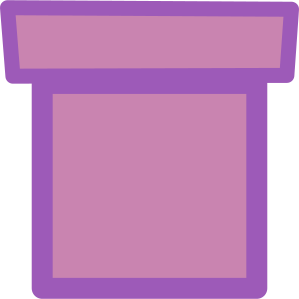

# Tube

The internet is a [series of tubes](https://en.wikipedia.org/wiki/Series_of_tubes).

Tube will give you your very own encrypted tube to send files from one browser to another.

Tube will be privacy first:
+ Data will be end-to-end encrypted.
+ No (payload) data will be stored by the server, it will simply act as a proxy from the sender to the reciever.
+ As little personal data as possible will be collected from users.
