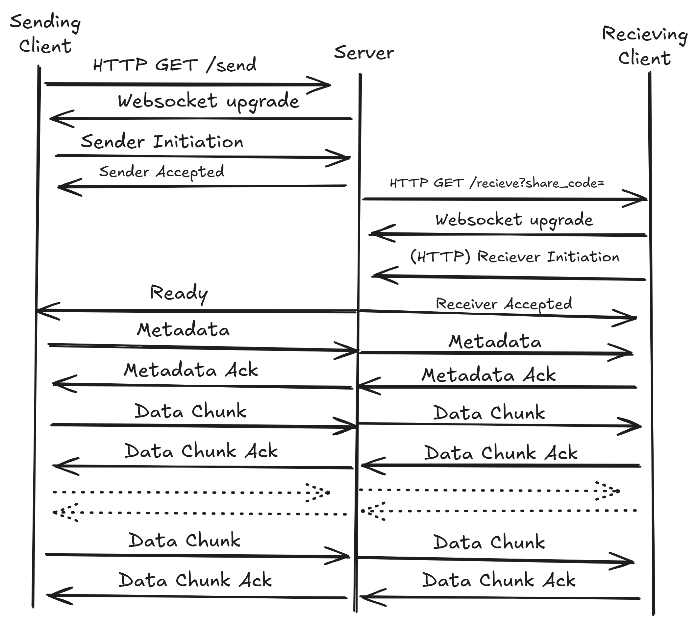

# The Tube Message Protocol (Version 0)

## Message Types

### Sender Initiation

| Component         | Length    | Value |
| ----------------- | --------- | ----- |
| opcode            | 1 byte    | 0x01  |
| version           | 1 byte    | 0x00  |
 
### Sender Accepted

| Component         | Length    | Value |
| ----------------- | --------- | ----- |
| opcode            | 1 byte    | 0x02  |
| version           | 1 byte    | 0x00  |
| share-code        | 5 bytes   |       |

### Receiver Initiation 

| Component         | Length    | Value |
| ----------------- | --------- | ----- |
| opcode            | 1 byte    | 0x03  |
| version           | 1 byte    | 0x00  |
| client public key | 512 bytes |       |
| share-code        | 5 bytes   |       |

### Recevier Accepted

| Component         | Length    | Value |
| ----------------- | --------- | ----- |
| opcode            | 1 byte    | 0x04  |
| version           | 1 byte    | 0x00  |

### Ready 

| Component         | Length    | Value |
| ----------------- | --------- | ----- |
| opcode            | 1 byte    | 0x05  |
| version           | 1 byte    | 0x00  |
| client public key | 512 bytes |       |

### Metadata 

| Component                  | Length    | Value |
| -------------------------- | --------- | ----- |
| opcode                     | 1 byte    | 0x06  |
| version                    | 1 byte    | 0x00  |
| filename length            | 1 bytes   | `n`   |
| filename utf-8 (encrypted) | `n` bytes |       |
| number of chunks           | 2 bytes   |       |

### Data Chunk

| Component           | Length  | Value |
| ------------------- | ------- | ----- |
| opcode              | 1 byte  | 0x07  |
| version             | 1 byte  | 0x00  |
| payload length      | 2 bytes | `n`   |
| payload (encrypted) | `n` bytes |     |

### Acknowledge

| Component           | Length  | Value |
| ------------------- | ------- | ----- |
| opcode              | 1 byte  | 0x07  |
| version             | 1 byte  | 0x00  |
| chunk number (or metadata) | 2 bytes | chunk number if < 0xFF or metadata if 0xFF |

